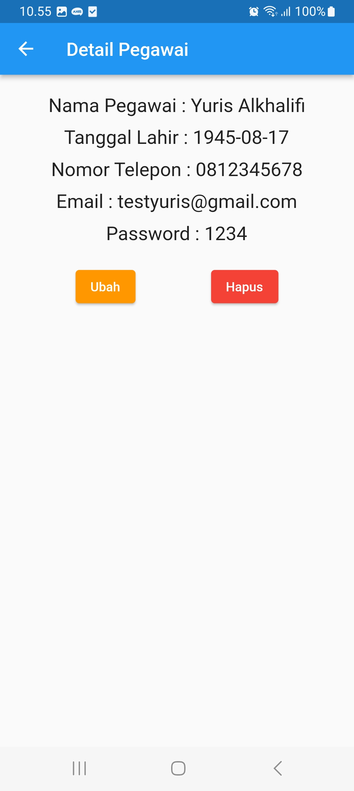

# klinik_app

 

Klinik App adalaha aplikasi klinik berbasis Mobile dengan menggunakan framewok Flutter. Terdapat 3 utama yang terdapat pada aplikasi yakni poli, pegawai, dan pasien.

## skenario kebutuhan pengguna
### Admin

<ol>
    <li>Admin dapat melakukan login.</li>
    <li>Admin dapat melihat, menambahkan, memperbarui dan menghapus data Poli.</li>
    <li>Admin dapate melihat, menambahkan, memperbarui dan menghapus data Pegawa.</li>
    <li>Admin dapat melihat, menambahkan, memperbarui dan menghapus data Pasien.</li>
    <li>Admin dapat melakukan logout.</li>
</ol>

### Screenshot Aplikasi
<table>
    <tbody>
    <tr>
        <td width="33%">
            <h5 styles="text-align: center">Login<h5>
            
        </td>
        <td width="33%">
            <h5 styles="text-align: center">Form Tambah Pegawai<h5>
            
        </td>
        <td width="33%">
            <h5 styles="text-align: center">Form Detail Pegawai<h5>
            
        </td>
    </tr>
    </tbody>
</table>

## Prequisite
untuk menjalankan aplikasi ini disarankan untuk menyiapkan aplikasi berikut ini:
    -[x] Android Studiu Griffe <code> 2022.03.1 Patch 1</code>
    -[x] Flutter <code>3.13.2</code>
    -[x] Dart <code>3.1.0</code>
    -[x] Java JDK <code>19.0.0</code>
    -[x] Git <code>2.35</code>

## Credit & License
Project ini mengacu pada modul parktik dari mata kuliah Mobile Programming Universitas Bina Saran INformatika (UBSI). Project ini bersifat open-source untuk edukasi.
<blockquote>Kuliah...? BSI AJA !!</blockquote>